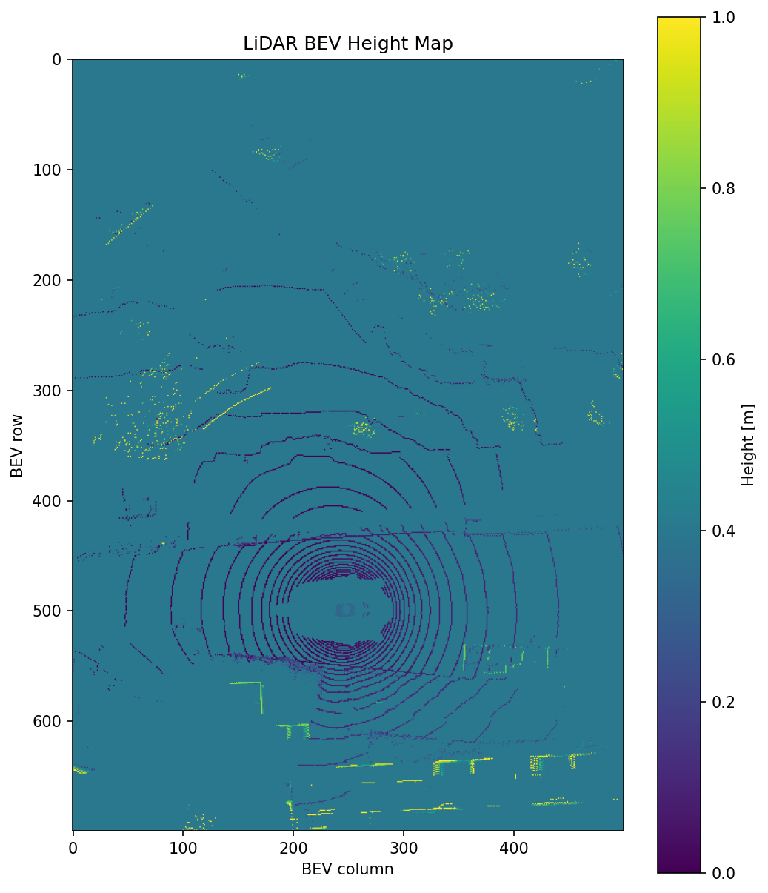
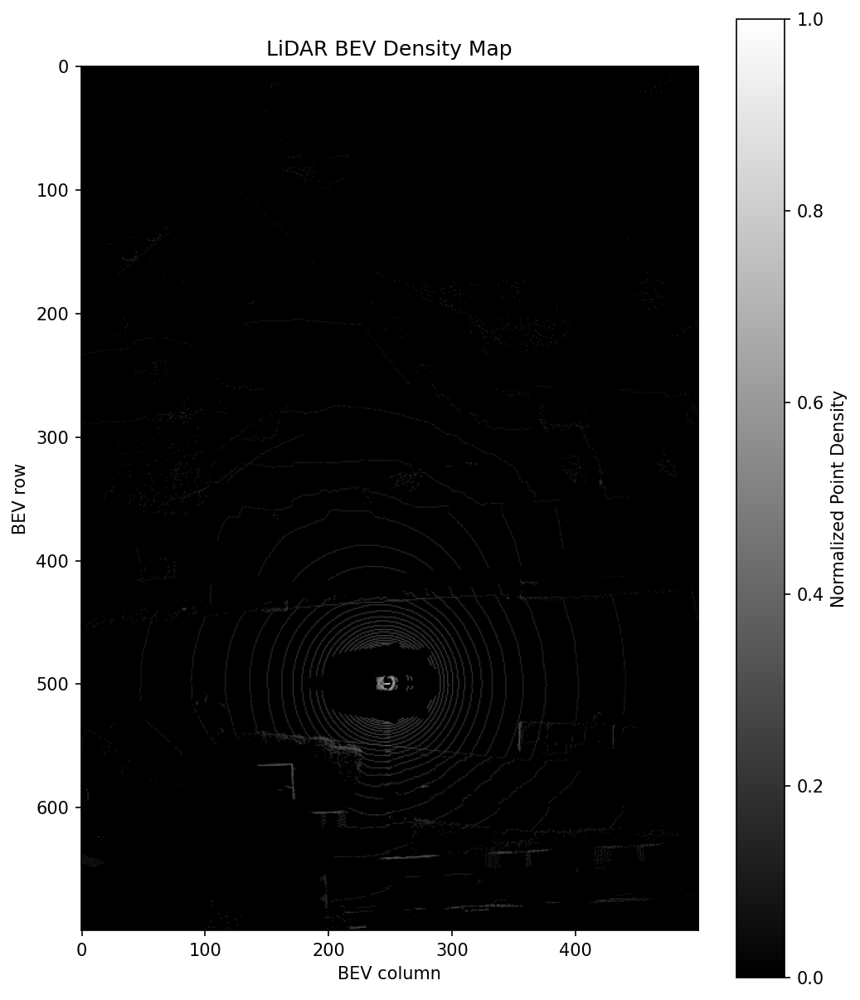
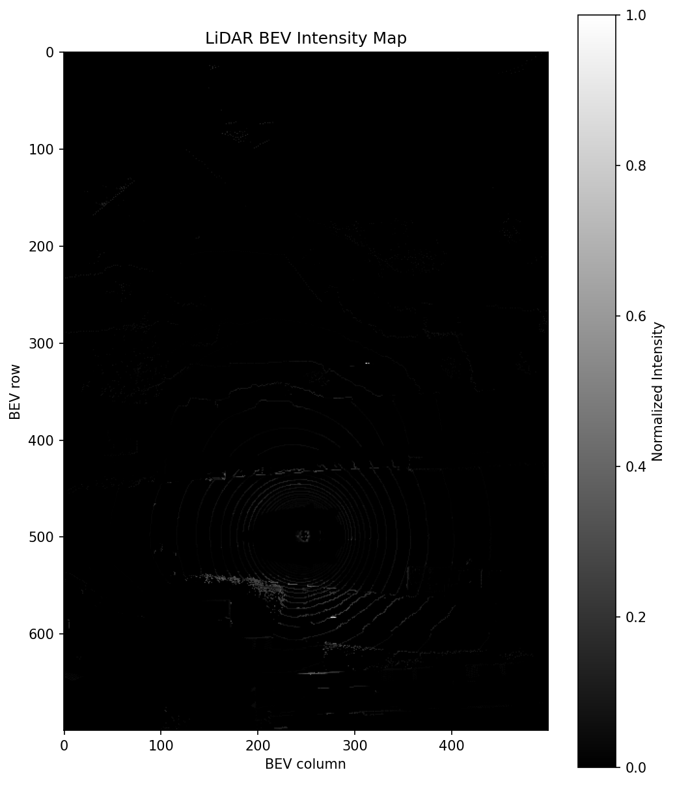
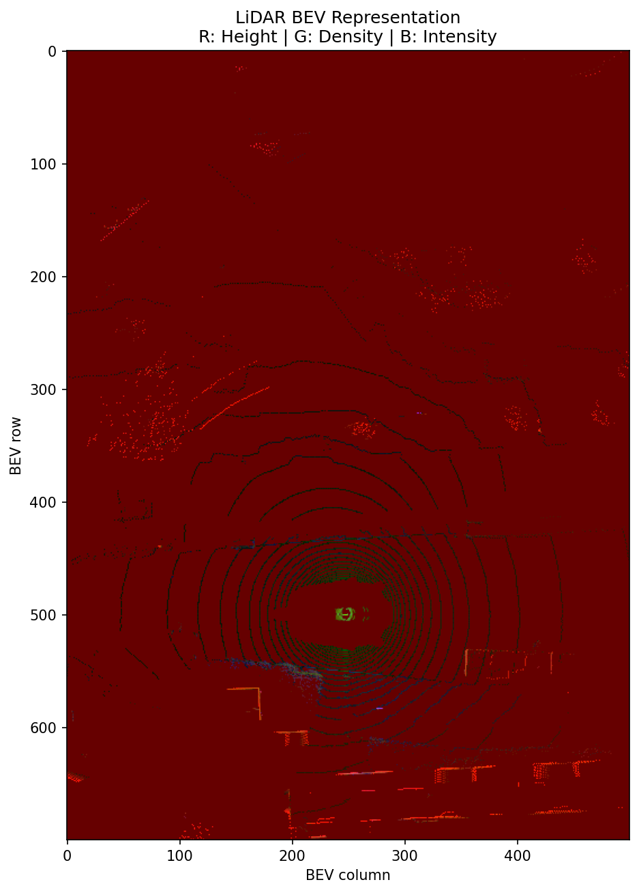

# V3 - LiDAR BEV Representation

## Overview

V3 converts raw LiDAR point clouds into a structured Bird's-Eye-View representation.

Unlike the simple scatter visualization used in V1, this version rasterizes irregular LiDAR points into a fixed spatial grid and constructs multiple BEV feature channels.

The pipeline is:

```text
Raw LiDAR Point Cloud
        ↓
ROI Filtering
        ↓
Metric Coordinates
        ↓
BEV Grid Coordinates
        ↓
Height Map
Density Map
Intensity Map
        ↓
Normalization
        ↓
3-Channel BEV Tensor
```

---

## BEV Configuration

The BEV region is defined as:

```text
X range: -20 m to 50 m
Y range: -25 m to 25 m
Resolution: 0.1 m / pixel
```

This results in:

```text
BEV Height: 700
BEV Width:  500
```

Therefore, the final tensor has the shape:

```text
(3, 700, 500)
```

---

## Coordinate Rasterization

Each LiDAR point is originally represented in metric coordinates:

```text
(x, y, z)
```

The x-y position is converted into a discrete BEV grid location:

```text
(x, y)
   ↓
(row, column)
```

Only points inside the configured region of interest are retained.

---

## Height Map

For each BEV cell, the maximum LiDAR height is stored.

```text
Multiple LiDAR points
        ↓
Same BEV cell
        ↓
Maximum z value
        ↓
Height feature
```

The height values are clipped to a predefined range and normalized to `[0, 1]`.

Result:



---

## Density Map

The density channel represents the number of LiDAR points falling into each BEV cell.

A logarithmic transformation is used to reduce the influence of highly populated cells:

```text
Point count
    ↓
log(1 + count)
    ↓
Normalization
```

Result:



---

## Intensity Map

The intensity channel stores the mean LiDAR return intensity for each occupied BEV cell.

```text
LiDAR intensity values
        ↓
Average per cell
        ↓
Normalization
```

Result:



---

## 3-Channel BEV Tensor

The three feature maps are stacked into a structured tensor:

```text
Channel 0: Height
Channel 1: Density
Channel 2: Intensity
```

Final representation:

```text
BEV Tensor Shape: (3, 700, 500)

Minimum value: 0.0
Maximum value: 1.0
```

This representation can be directly consumed by CNN- or Transformer-based perception models.

---

## RGB Visualization

For visualization purposes, the three channels are mapped to RGB:

```text
R → Height
G → Density
B → Intensity
```

Result:



---

## Important Distinction

This version implements a handcrafted LiDAR-based BEV representation.

It should not be confused with learned camera-to-BEV representations such as BEVFormer.

```text
V3:

LiDAR
  ↓
Rasterization
  ↓
Height / Density / Intensity
  ↓
BEV Tensor
```

Modern learned BEV models typically follow:

```text
Multi-Camera Images
        ↓
Image Backbone
        ↓
Feature Transformation
        ↓
Learned BEV Features
```

V3 provides the geometric and representation foundation for the later integration of modern BEV perception models.

---

## Project Structure

```text
src/
└── bev/
    ├── __init__.py
    └── rasterizer.py

scripts/
└── generate_bev.py

outputs/
└── v3/
    ├── bev_grid_test.png
    ├── bev_height_map.png
    ├── bev_density_map.png
    ├── bev_intensity_map.png
    ├── bev_rgb.png
    └── bev_tensor.npy
```

---

## V3 Summary

Implemented:

- LiDAR ROI filtering
- Metric-to-grid coordinate conversion
- BEV rasterization
- Height map generation
- Density map generation
- Intensity map generation
- Feature normalization
- 3-channel BEV tensor construction
- RGB BEV visualization

---

## Next Version

**V4 - Modern BEV Perception and Trajectory**

The next version will integrate an existing pretrained autonomous-driving model and focus on:

- learned BEV representations
- pretrained model inference
- trajectory prediction
- visualization and analysis