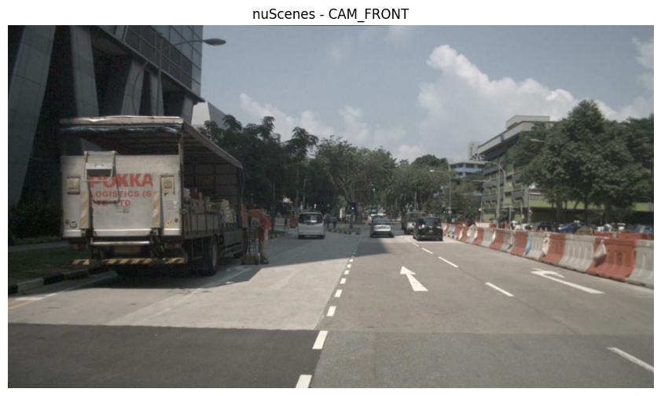
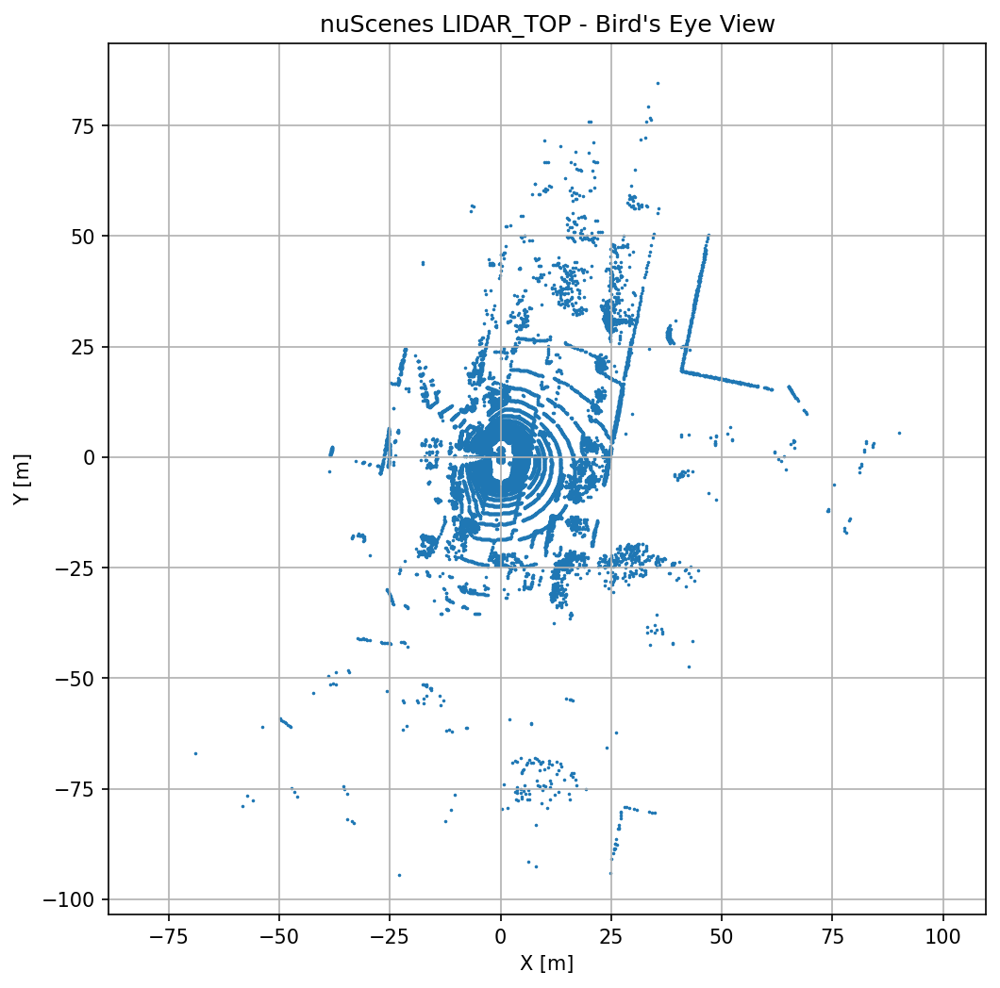

# V2 - LiDAR-to-Camera Projection

## Overview

The objective of V2 is to implement the complete geometric projection pipeline between LiDAR and camera without relying on existing projection utilities.

Starting from the raw sensor calibration provided by the nuScenes dataset, the entire transformation pipeline is implemented from scratch, including coordinate transformations, homogeneous matrices, camera projection and depth visualization.

---

## Pipeline

```
LiDAR Point Cloud
        │
        ▼
LiDAR Calibration
        │
        ▼
Ego Vehicle Coordinate
        │
        ▼
Camera Calibration
        │
        ▼
Camera Coordinate
        │
        ▼
Camera Intrinsic Matrix
        │
        ▼
Image Plane
        │
        ▼
Depth Visualization
```

---

## Coordinate Systems

```
LiDAR Frame
        │
        ▼
Ego Frame
        │
        ▼
Camera Frame
        │
        ▼
Image Plane
```

---

## Homogeneous Transformation

The LiDAR points are first transformed into the ego vehicle frame using the sensor extrinsic calibration.

$$
T\_\{ego\}\^\{lidar\}
\=
\\begin\{bmatrix\}
R \& t\\\\
0 \& 1
\\end\{bmatrix\}
$$

where

- $$R$$ denotes the rotation matrix.
- $$t$$ denotes the translation vector.

---

The inverse camera transformation is

$$
T\_\{camera\}\^\{ego\}
\=
\\left\(T\_\{ego\}\^\{camera\}\\right\)\^\{\-1\}
$$

The complete transformation from LiDAR to Camera becomes

$$
T\_\{camera\}\^\{lidar\}
\=
T\_\{camera\}\^\{ego\}
\\cdot
T\_\{ego\}\^\{lidar\}
$$

---

## Camera Projection

After transforming every LiDAR point into the camera coordinate system,

$$
P\_c\=\(X\_c\,Y\_c\,Z\_c\)
$$

only points satisfying

$$
Z\_c\>0
$$

are kept.

The projection into image coordinates is performed using the camera intrinsic matrix

$$
K\=
\\begin\{bmatrix\}
f\_x\&0\&c\_x\\\\
0\&f\_y\&c\_y\\\\
0\&0\&1
\\end\{bmatrix\}
$$

The image pixels are computed as

$$
\\begin\{bmatrix\}
u\\\\
v\\\\
1
\\end\{bmatrix\}
\=
K
\\begin\{bmatrix\}
X\_c\\\\
Y\_c\\\\
Z\_c
\\end\{bmatrix\}
$$

followed by

$$
u\=\\frac\{u\}\{Z\_c\}\,
\\qquad
v\=\\frac\{v\}\{Z\_c\}
$$

---

## Depth Visualization

The camera-frame depth

$$
Depth \= Z\_c
$$

is used for visualization.

Near points are rendered using warm colors,
while distant points are rendered using cool colors.

---

## Implementation

Implemented from scratch

- Calibration parser
- Homogeneous transformation matrix
- Matrix inversion
- LiDAR → Ego transformation
- Ego → Camera transformation
- Camera intrinsic projection
- Pixel filtering
- Depth coloring
- Multi-frame rendering

---

## Results

### Camera Image



---

### LiDAR Bird's Eye View



---

### Projection Animation


---

## Summary

This version implements the complete geometric projection pipeline between LiDAR and camera without relying on any existing projection functions.

The project establishes the mathematical foundation required for modern autonomous driving perception systems, including:

- BEV perception
- Occupancy prediction
- 3D object detection
- Sensor fusion
- World models

---

## Next Version

**V3 - Bird's Eye View Representation**

Upcoming topics include

- BEV grid generation
- Occupancy map construction
- LiDAR rasterization
- Camera-BEV representation